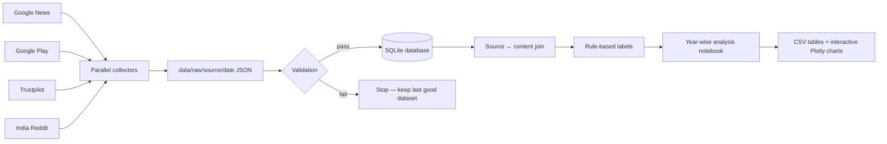
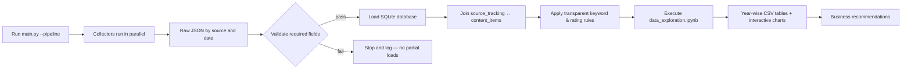

<div align="center">

# Zomato Consumer Research Pipeline

### India-focused, year-wise public-feedback pipeline for Zomato consumer research


**No AI model or external prediction service is used anywhere in this pipeline.**

</div>

---

## Table of Contents

- [What This Project Does](#-what-this-project-does)
- [Architecture](#-architecture)
- [Data Sources & Business Definitions](#-data-sources--business-definitions)
- [Project Structure](#-project-structure)
- [Getting Started — Step by Step](#-getting-started--step-by-step)
- [Commands Reference](#-commands-reference)
- [Results — Tables & Charts](#-results--tables--charts)
- [Business Recommendations](#-business-recommendations)
- [Scheduling (Daily Runs)](#-scheduling-daily-runs)

---

## What This Project Does

It collects public records from **Google News**, **Google Play**, **Trustpilot**, and **India-focused Reddit communities**, stores the raw history, loads a unified SQLite database, applies transparent rating/keyword rules, and automatically refreshes a year-wise analysis notebook — tables, ratios and interactive charts included.

---

## Architecture



### Pipeline flow (End to End)



---

## Data Sources & Business Definitions

| Source | What it contributes | Positive signal | Negative signal |
|---|---|---|---|
| **Google Play** | App reviews and star ratings | 4–5 stars | 1–3 stars |
| **Trustpilot** | Customer reviews and ratings | 4–5 stars | 1–3 stars |
| **Reddit** | India-focused posts & comments | Non-complaint feedback | Complaint keyword match |
| **Google News** | Editorial / news coverage | `Zomato` coverage | `Zomato complaint` coverage |

---

##  Project Structure

```text
.
├── main.py                         # pipeline controller
├── config.py                       # paths, queries and source settings
├── data_exploration.ipynb          # tables, analysis and Plotly charts
├── scripts/
│   ├── base_collector.py           # common collection framework
│   ├── google_news_collector.py
│   ├── google_play_collector.py
│   ├── trustpilot_collector.py
│   ├── reddit_collector.py
│   ├── dblite_loader.py            # SQLite schema and raw JSON loader
│   └── rule_labels.py              # fixed keyword and rating rules — NOT an AI model
├── utils/                          # retry, throttle and storage helpers
├── data/raw/                       # dated raw JSON snapshots (audit trail)
├── data/db/Zomato.db               # analytical SQLite database
├── output/                         # CSV summaries and run history
└── docs/                           # manager documentation, tables and charts
```

---

##  Getting Started — Step by Step

### Step 1 — Clone the repository

```bash
git clone <your-repository-url>
cd zomato_raw_collection
```

### Step 2 — Install dependencies

```bash
pip install -r requirements.txt
```

### Step 3 — Run the complete pipeline

```bash
python main.py --pipeline
```

This single command runs the full flow:

```text
Parallel crawl → raw JSON → validation → SQLite load → rule-based labels → notebook execution
```

### Step 4 — Check the output

| What you want | Where to look |
|---|---|
| Year-wise CSV tables | `output/yearly_*.csv` |
| All tables| [`docs/output_tables.md`](docs/output_tables.md) |
| charts | [`docs/charts/`](docs/charts/) |
| Run log | `logs/collection_<date>.log` |
| Run summary | `output/last_pipeline_run.json` |
| Source-wise audit trail | `output/collection_history.json` |

### Step 5 (optional) — Explore interactively

```bash
jupyter notebook data_exploration.ipynb
```

---

##  Commands Reference

```bash
python main.py --pipeline       # complete collection and analysis run
python main.py                  # same flow using all default collectors
python main.py google_play      # run one collector, then load and analyse
python main.py --validate       # validate latest raw JSON files
python main.py --load-db        # load existing raw snapshots into SQLite
python main.py --label-data     # refresh transparent rules-based labels
jupyter notebook data_exploration.ipynb
```

---

##  Results — Tables & Charts

> All figures below are generated directly from `data_exploration.ipynb` and saved to `output/*.csv`. Interactive (hover/zoom/filter) versions of every chart live in [`docs/charts/`](docs/charts/).

### Google Play — Yearly Review Volume


### Trustpilot — Yearly Review Volume


### Google News — Broad Coverage vs Complaint Coverage


### Reddit — Yearly Feedback Volume (India-focused subreddits)


>  All four charts above are pulled directly from the executed `data_exploration.ipynb` — same figures, same colours, same axis labels you'll see if you open the notebook yourself.

### Full data tables

| Output file | Purpose |
|---|---|
| [`yearly_rating_source_summary.csv`](output/yearly_rating_source_summary.csv) | Google Play and Trustpilot positive/negative counts and ratios |
| [`yearly_google_news_summary.csv`](output/yearly_google_news_summary.csv) | Broad article count, complaint count and complaint ratio |
| [`yearly_reddit_summary.csv`](output/yearly_reddit_summary.csv) | Reddit feedback, complaint count and complaint rate |
| [`yearly_feedback_comparison.csv`](output/yearly_feedback_comparison.csv) | Merged source-wise comparison |
| [`yearly_all_source_volume.csv`](output/yearly_all_source_volume.csv) | Overall yearly positive and negative volume |

All rendered table outputs are also available in [`docs/output_tables.md`](docs/output_tables.md).

---

##  Business Recommendations

> *"This source and year show a higher negative signal in public feedback, so this journey should be investigated first."* This keeps every finding honest — a signal for investigation, not a verdict on the business.

---

##  Scheduling (Daily Runs)

For **Windows Task Scheduler**, schedule this command from the project folder:

```bash
python main.py --pipeline
```

Set the project folder as **Start in**. Review `logs/collection_<date>.log` and `output/collection_history.json` after each run.


</div>
