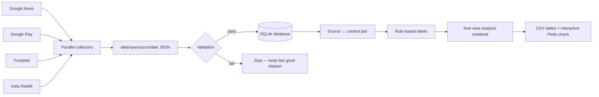
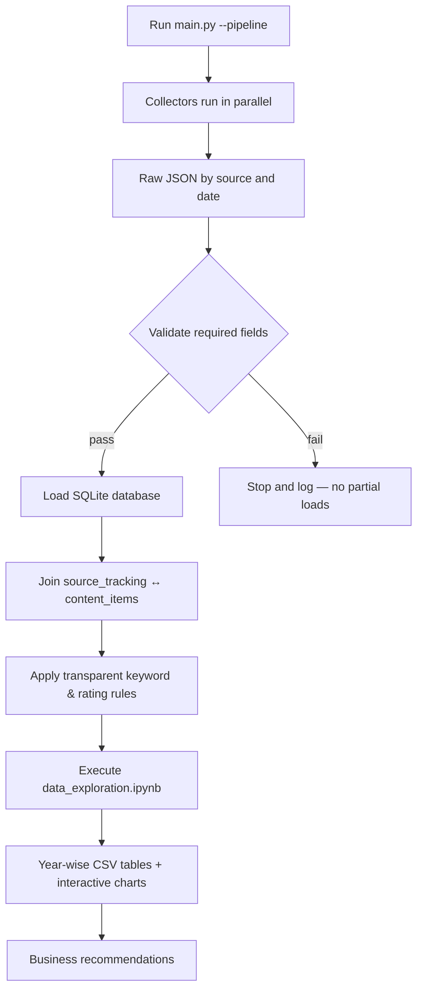
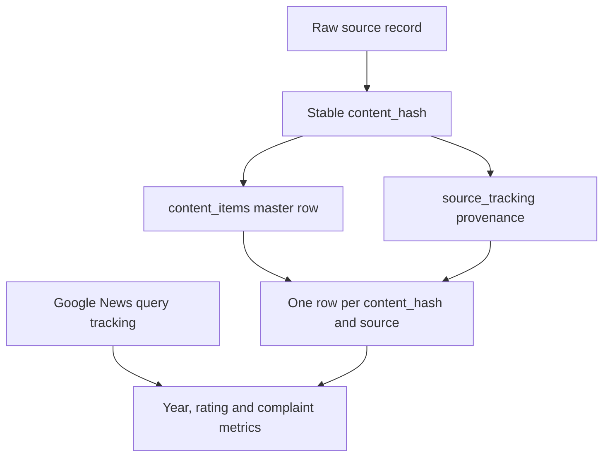
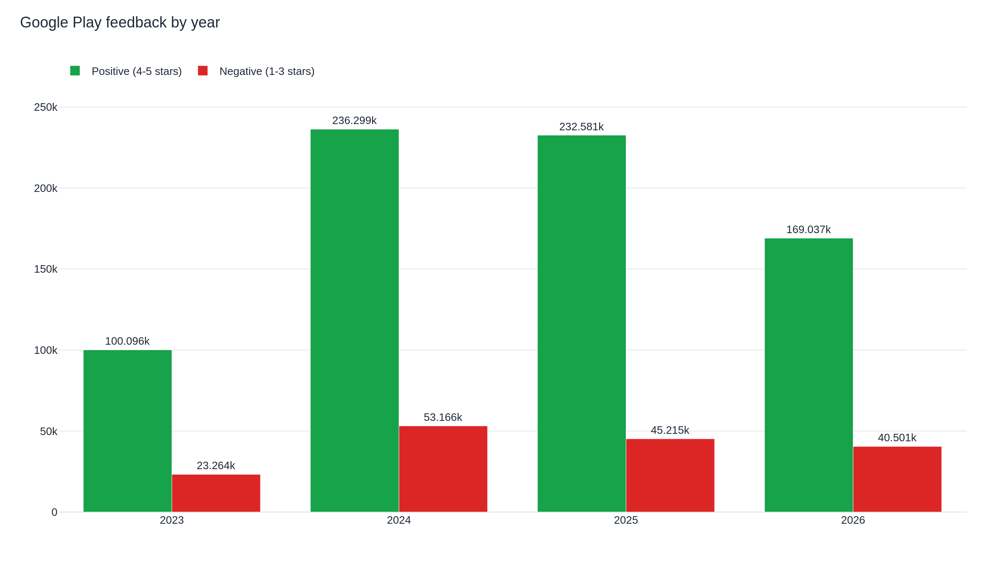
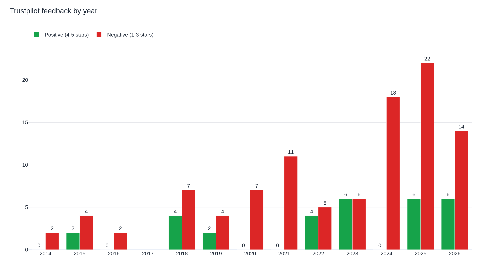
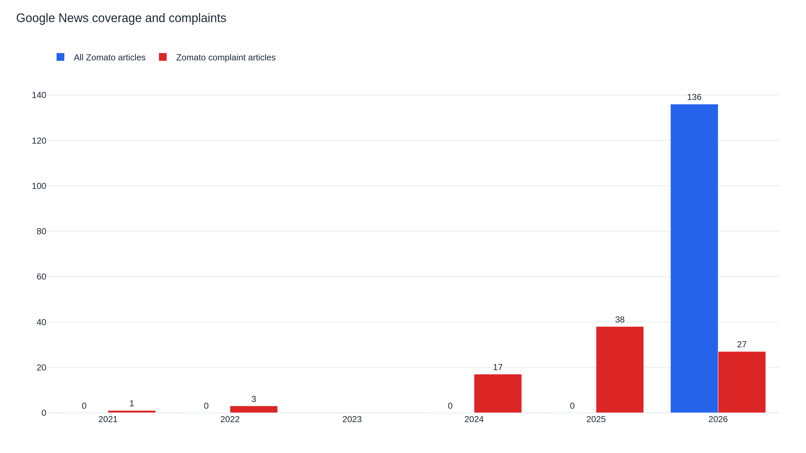
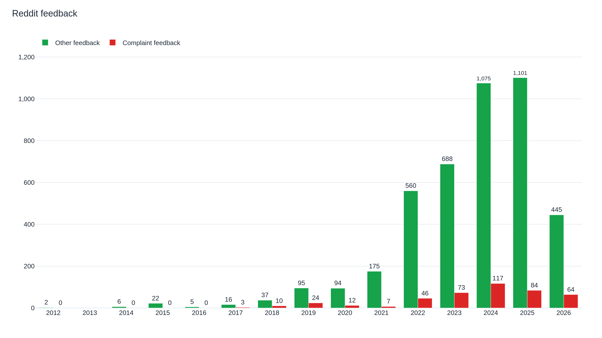

# zomato-feedback-pipeline
<div align="center">

# 🍽️ Zomato Consumer Research Pipeline

### A reproducible, India-focused, year-wise public-feedback pipeline for Zomato consumer research


**No AI model or external prediction service is used anywhere in this pipeline.**
Every label is a deterministic, auditable rating threshold or keyword rule.

</div>

---

## 📌 Table of Contents

- [What This Project Does](#-what-this-project-does)
- [Why It Exists](#-why-it-exists)
- [Architecture](#-architecture)
- [Data Sources & Business Definitions](#-data-sources--business-definitions)
- [Project Structure](#-project-structure)
- [Getting Started — Step by Step](#-getting-started--step-by-step)
- [Commands Reference](#-commands-reference)
- [How the Data Is Joined](#-how-the-data-is-joined)
- [Results — Tables & Charts](#-results--tables--charts)
- [Business Recommendations](#-business-recommendations)
- [Scheduling (Daily Runs)](#-scheduling-daily-runs)
- [Limitations & Responsible Use](#-limitations--responsible-use)
- [Documentation Index](#-documentation-index)

---

## 🎯 What This Project Does

This project answers one practical, board-room-ready question:

> **Where and when are negative Zomato customer-experience signals most visible, across the public sources we are permitted to collect from?**

It collects public records from **Google News**, **Google Play**, **Trustpilot**, and **India-focused Reddit communities**, stores the raw history, loads a unified SQLite database, applies transparent rating/keyword rules, and automatically refreshes a year-wise analysis notebook — tables, ratios and interactive charts included.

## 💡 Why It Exists

Most "scrape and chart" scripts answer a question for a single day. This pipeline is built to be run **again and again** — daily if required — so that a real trend, not a snapshot, can be tracked over time. Three principles drive every design decision here:

| Principle | What it means in practice |
|---|---|
| 🔍 **Fully auditable labels** | Every "positive" / "negative" tag traces back to a plain rating threshold or keyword rule — never a black-box model. |
| 🗄️ **Nothing is thrown away** | Raw JSON is stored, dated, and untouched — so a labelling-rule change never requires re-scraping. |
| 📊 **Signals, not verdicts** | Output ratios point the business toward where to look — a human still reads the underlying text before recommending action. |

---

## 🏗️ Architecture



### End-to-end pipeline flow



Google News and Reddit are restricted to two approved search terms only — `Zomato` and `Zomato complaint` — and Reddit is limited to configured India-focused subreddits (`india`, `delhi`, `mumbai`, `bangalore`, `hyderabad`, `chennai`, `kolkata`, `pune`, `food`).

---

## 📊 Data Sources & Business Definitions

| Source | What it contributes | Positive signal | Negative signal |
|---|---|---|---|
| 📱 **Google Play** | App reviews and star ratings | 4–5 stars | 1–3 stars |
| ⭐ **Trustpilot** | Customer reviews and ratings | 4–5 stars | 1–3 stars |
| 💬 **Reddit** | India-focused posts & comments | Non-complaint feedback | Complaint keyword match |
| 📰 **Google News** | Editorial / news coverage | `Zomato` coverage | `Zomato complaint` coverage |

> ℹ️ A fifth source (YouTube) was evaluated and **intentionally retired** — the scraper was slow, repeatedly hit bot-detection, and could not run unattended reliably. See [Limitations](#-limitations--responsible-use).

---

## 📁 Project Structure

```text
.
├── main.py                         # pipeline controller
├── config.py                       # paths, queries and source settings
├── data_exploration.ipynb          # tables, analysis and Plotly charts
├── scripts/
│   ├── base_collector.py           # common collection framework
│   ├── google_news_collector.py
│   ├── google_play_collector.py
│   ├── trustpilot_collector.py
│   ├── reddit_collector.py
│   ├── dblite_loader.py            # SQLite schema and raw JSON loader
│   └── rule_labels.py              # fixed keyword and rating rules — NOT an AI model
├── utils/                          # retry, throttle and storage helpers
├── data/raw/                       # dated raw JSON snapshots (audit trail)
├── data/db/Zomato.db               # analytical SQLite database
├── output/                         # CSV summaries and run history
└── docs/                           # manager documentation, tables and charts
```

---

## 🚀 Getting Started — Step by Step

### Step 1 — Clone the repository

```bash
git clone <your-repository-url>
cd zomato_raw_collection
```

### Step 2 — Install dependencies

```bash
pip install -r requirements.txt
```

### Step 3 — Run the complete pipeline

```bash
python main.py --pipeline
```

This single command runs the full flow:

```text
Parallel crawl → raw JSON → validation → SQLite load → rule-based labels → notebook execution
```

### Step 4 — Check the output

| What you want | Where to look |
|---|---|
| Year-wise CSV tables | `output/yearly_*.csv` |
| All rendered tables together | [`docs/output_tables.md`](docs/output_tables.md) |
| Interactive Plotly charts | [`docs/charts/`](docs/charts/) |
| Run log | `logs/collection_<date>.log` |
| Run summary | `output/last_pipeline_run.json` |
| Source-wise audit trail | `output/collection_history.json` |

### Step 5 (optional) — Explore interactively

```bash
jupyter notebook data_exploration.ipynb
```

### Step 6 (optional) — Schedule it to run daily

See [Scheduling](#-scheduling-daily-runs) below.

---

## ⚙️ Commands Reference

```bash
python main.py --pipeline       # complete collection and analysis run
python main.py                  # same flow using all default collectors
python main.py google_play      # run one collector, then load and analyse
python main.py --validate       # validate latest raw JSON files
python main.py --load-db        # load existing raw snapshots into SQLite
python main.py --label-data     # refresh transparent rules-based labels
jupyter notebook data_exploration.ipynb
```

---

## 🔗 How the Data Is Joined



1. Every source record is retained, unmodified, in `data/raw/<source>/<date>/`.
2. The loader computes a stable `content_hash` and writes one row per unique item to `content_items`.
3. `source_tracking.content_hash` joins to `content_items.content_hash`, attaching source, type, rating, text and date.
4. The notebook keeps **one row per `content_hash` and source** before analysis, so repeated historical snapshots never inflate a chart.
5. Google News uses a separate `google_news_query_tracking` table, since one article can match both the broad `Zomato` query and the `Zomato complaint` query.

---

## 📈 Results — Tables & Charts

> All figures below are generated directly from `data_exploration.ipynb` and saved to `output/*.csv`. Interactive (hover/zoom/filter) versions of every chart live in [`docs/charts/`](docs/charts/).

### Google Play — Yearly Review Volume

2023–2026 tracked: negative share has stayed in a fairly tight **16–19%** band each year — 2026 (year to date): **169,037 positive** vs **40,501 negative** (19.3% negative).



### Trustpilot — Yearly Review Volume

Consistently the **highest negative share** of the four sources. 2025 recorded its highest-ever complaint volume — **22 negative** vs **6 positive** (78.6% negative) — and four separate years (2014, 2016, 2020, 2021) show **100% negative**, though on very small review counts.



### Google News — Broad Coverage vs Complaint Coverage

2026 (year to date): **136 broad** `Zomato` articles vs **27** `Zomato complaint` articles → complaint ratio **~20%**. Note that 2021, 2022, 2024 and 2025 currently show complaint-article counts only, with **0** recorded for the broad query — this is a known data-quality gap, flagged in [Limitations](#-limitations--responsible-use).



### Reddit — Yearly Feedback Volume (India-focused subreddits)

Complaint **rate** (not volume) peaked in **2018** — 10 complaints out of 47 feedback items (**21.3%**) — even though raw complaint *volume* is far higher in recent years (e.g. 117 complaints in 2024) simply because overall Reddit activity has grown sharply since 2022.



> 📌 All four charts above are pulled directly from the executed `data_exploration.ipynb` — same figures, same colours, same axis labels you'll see if you open the notebook yourself.

### Full data tables

| Output file | Purpose |
|---|---|
| [`yearly_rating_source_summary.csv`](output/yearly_rating_source_summary.csv) | Google Play and Trustpilot positive/negative counts and ratios |
| [`yearly_google_news_summary.csv`](output/yearly_google_news_summary.csv) | Broad article count, complaint count and complaint ratio |
| [`yearly_reddit_summary.csv`](output/yearly_reddit_summary.csv) | Reddit feedback, complaint count and complaint rate |
| [`yearly_feedback_comparison.csv`](output/yearly_feedback_comparison.csv) | Merged source-wise comparison |
| [`yearly_all_source_volume.csv`](output/yearly_all_source_volume.csv) | Overall yearly positive and negative volume |

All rendered table outputs are also available in [`docs/output_tables.md`](docs/output_tables.md).

---

## 🧭 Business Recommendations

> **Recommended wording for any external-facing slide:** *"This source and year show a higher negative signal in public feedback, so this journey should be investigated first."* This keeps every finding honest — a signal for investigation, not a verdict on the business.

1. **Trustpilot's negative share is the highest and rising** (78.6% in 2025) — this is the clearest signal in the whole dataset and should be the first source read line-by-line for delivery delay, refund and support-escalation themes.
2. **Google Play's negative share is stable and much lower** (16–19% across 2023–2026) — expected, since app-store reviewers skew toward regular users — but still worth a periodic scan of 1–3 star text for payment/login/crash themes.
3. **Reddit's complaint rate has been trending down since its 2018 peak** (21.3% → single digits in 2021–2025) even as raw activity has grown — a good-news signal worth validating with a manual read, since it runs counter to the Trustpilot trend.
4. **Google News complaint spikes** should always be read against the actual headlines before escalation — coverage can spike for reasons unrelated to day-to-day service quality, and the broad-query gap in several years (see above) should be fixed before this source is used in a formal report.

---

## ⏰ Scheduling (Daily Runs)

For **Windows Task Scheduler**, schedule this command from the project folder:

```bash
python main.py --pipeline
```

Set the project folder as **Start in**. Review `logs/collection_<date>.log` and `output/collection_history.json` after each run.

---

## ⚠️ Limitations & Responsible Use

- Only **4 of 5** required sources are currently active — YouTube was retired due to unreliable unattended runs; a fifth independent source is pending before final submission if the assessment enforces a five-source gate.
- `output/*.csv` on disk reflects only the **most recent load** and can look thinner than the notebook's own computed tables, which run against the full accumulated raw history. The charts and figures in this README are taken directly from the **executed notebook**, so treat those as the source of truth over the CSV snapshots until the CSV export step is re-run end-to-end.
- The Google News broad-query count is recorded as **0** for 2021, 2022, 2024 and 2025 — an ingestion gap, not a real absence of coverage — so the complaint ratio for those years should not be trusted until this is fixed.
- `yearly_all_source_volume.csv` currently shows a data-quality artefact for 2025 (a negative `positive_count` from a merge step) — flagged for correction; it does **not** affect the source-wise tables.
- This dataset is **public feedback**, not the complete Zomato customer population — treat ratios as **directional research signals**, not a full-population survey.
- Reddit's complaint detection is a transparent keyword rule and can miss sarcasm or mixed Hindi-English (Hinglish) phrasing — validate with a small hand-labelled sample before business-critical use.
- Use only permitted public access, respect rate limits and each source's terms of use. Validate major business decisions against internal Zomato operational data.

---

## 📚 Documentation Index

| Document | Purpose |
|---|---|
| [Project Manager Documentation](docs/project_manager_documentation.md) | Purpose, code explanation, joins, outputs and presentation guidance |
| [Hinglish Approach](docs/approach_hinglish.md) | Simple explanation for the assignment discussion |
| [Design Notes](docs/design.md) | Architecture, decisions, controls and scale considerations |
| [Full Notebook Tables](docs/output_tables.md) | All generated table outputs |

---

<div align="center">

**Built for repeatable, auditable, India-focused Zomato consumer research — no AI labelling, full raw-data history, and one command to refresh everything.**

</div>
